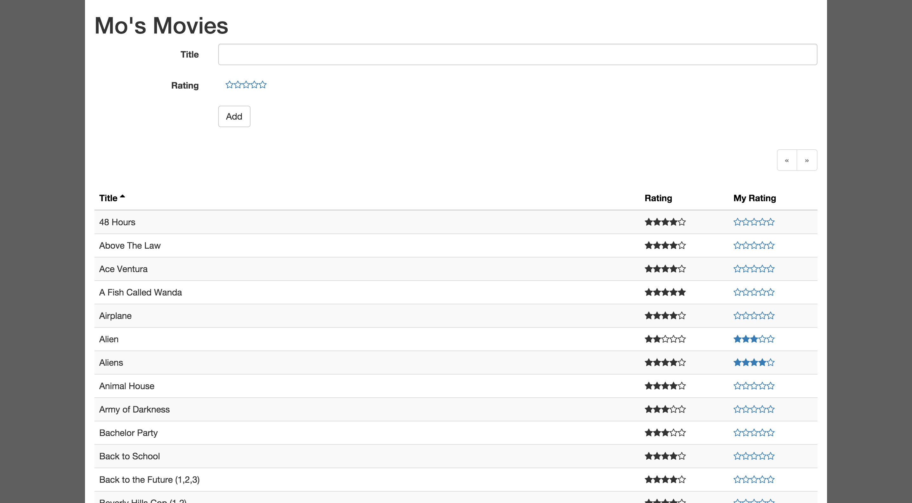

# Mo's Movies
Application to track movie ratings.

## Setup
To use the app, you will need to have the DB setup. See the Database instructions below. The following steps will install dependencies and compile the application. Compilation will transpile JSX files for use in the browser.

    npm install
    npm compile

## Running

    npm start 

## Database
The app is designed for PostgreSQL and will use the `DATABASE_URL` environment property to connect.

To update the database to the latest version

    node sql/migrate

## Heroku Button
Deploy to Heroku by clicking the following button:

